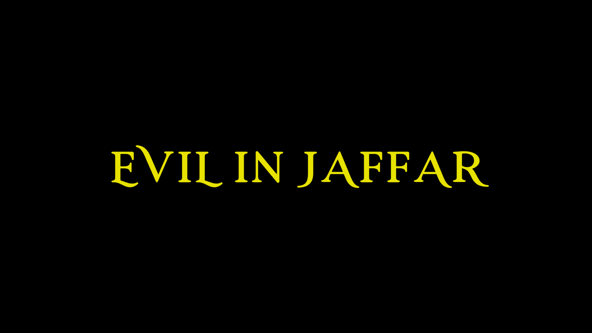

# Evil in Jaffar

Lies and deceit shall fall short,   
When the real knight will come forth,   
Born from a broken promise,   
He must keep his all,   
To save the world from it's biggest fall 
  
 

## Introduction

When the abode of heaven was created by the forces of good, a prophecy was made that an evil power will control the world as long as the angel of good doesn't intervene. 

Evil King of Jaffar is the greatest known servant of evil spirits to exist in the world who wants to rule the world using the eternal fire of dark power.

You are the Prince of Yemen born to defeat the Evil King of Jaffar and fulfill the prophecy of the heavens.

For this, you must set off on a journey to distant lands and clear each Quest to defeat the EVIL IN JAFFAR!

## Screenshots

## Instructions
Clear the 3 quests in the game by battling 3 different villains, the last one being the King of Jaffar. Each level gets harder by making the villain faster and harder to kill. Free your kingdom! 

## Controls
 - _Mouse_: Click once to attack, click twice to block
 - _"w"_: Press "w" to jump
 - _Arrow keys__: Use these to move your knight

## Deployment
 - https://evil-in-jaffar.netlify.app/

## Game Engine:
 - Unity 
 
## Contributers
 - [Saurabh Kumar Suryan](https://github.com/sksuryan)
 - [Vividha](https://github.com/V2dha)
 - [Shilpita Biswas](https://github.com/sh-biswas)
 
## Demo
https://www.youtube.com/watch?v=tFGd7Jy43RM&feature=emb_logo
